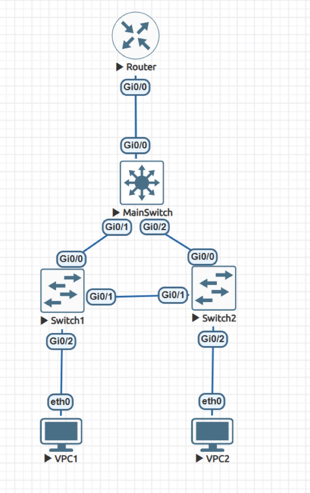
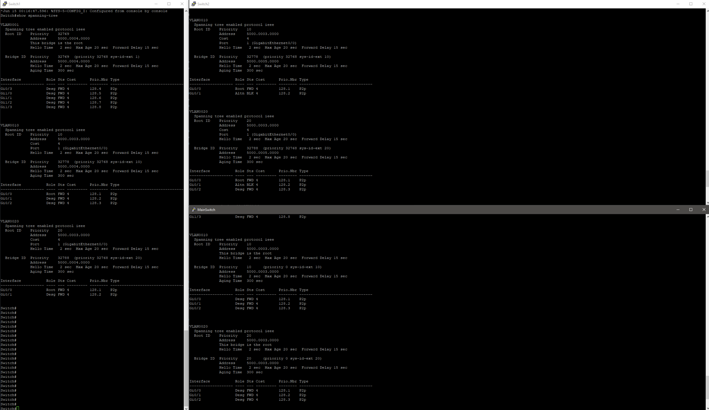

# Реализация небольшой сети офиса
## Топология

## VPC1
Настраиваем сеть для первого клиента.
```
VPCS> set pcname VPC1

VPC1> ip 10.0.10.1/24 10.0.10.10
Checking for duplicate address...
VPC1 : 10.0.10.1 255.255.255.0 gateway 10.0.10.10
```
### VPC1 conf
```
VPC1> show ip

NAME        : VPC1[1]
IP/MASK     : 10.0.10.1/24
GATEWAY     : 10.0.10.10
DNS         :
MAC         : 00:50:79:66:68:01
LPORT       : 20000
RHOST:PORT  : 127.0.0.1:30000
MTU         : 1500
```

## VPC2
Настраиваем сеть для второго клиента.
```
VPCS> set pcname VPC2

VPC2> ip 10.0.20.2/24 10.0.20.20
Checking for duplicate address...
VPC2 : 10.0.20.2 255.255.255.0 gateway 10.0.20.20
```
### VPC2 conf
```
VPC2> show ip

NAME        : VPC2[1]
IP/MASK     : 10.0.20.2/24
GATEWAY     : 10.0.20.20
DNS         :
MAC         : 00:50:79:66:68:02
LPORT       : 20000
RHOST:PORT  : 127.0.0.1:30000
MTU         : 1500
```

## Switch1
Настраиваем первый коммутатор доступа.
```
Switch>en
Switch#configure t
Enter configuration commands, one per line.  End with CNTL/Z.
Switch(config)#vlan 10
Switch(config-vlan)#exit
Switch(config)#vlan 20
Switch(config-vlan)#exit

Switch(config)#interface Gi0/2
Switch(config-if)#switchport mode access
Switch(config-if)#switchport access vlan 10
Switch(config-if)#exit

Switch(config)#interface Gi0/0
Switch(config-if)#switchport trunk encapsulation dot1q
Switch(config-if)#switchport mode trunk
Switch(config-if)#switchport trunk allowed vlan 10,20
Switch(config-if)#exit

Switch(config)#interface Gi0/1
Switch(config-if)#switchport trunk encapsulation dot1q
Switch(config-if)#switchport mode trunk
Switch(config-if)#switchport trunk allowed vlan 10,20
Switch(config-if)#exit

Switch(config)#exit
```

## Switch2
Настраиваем второй коммутатор доступа.
```
Switch>en
Switch#configure t
Enter configuration commands, one per line.  End with CNTL/Z.
Switch(config)#vlan 10
Switch(config-vlan)#exit
Switch(config)#vlan 20
Switch(config-vlan)#exit

Switch(config)#interface Gi0/2
Switch(config-if)#switchport mode access
Switch(config-if)#switchport access vlan 20
Switch(config-if)#exit

Switch(config)#interface Gi0/0
Switch(config-if)#switchport trunk encapsulation dot1q
Switch(config-if)#switchport mode trunk
Switch(config-if)#switchport trunk allowed vlan 10,20
Switch(config-if)#exit

Switch(config)#interface Gi0/1
Switch(config-if)#switchport trunk encapsulation dot1q
Switch(config-if)#switchport mode trunk
Switch(config-if)#switchport trunk allowed vlan 10,20
Switch(config-if)#exit

Switch(config)#exit
```


## MainSwitch
Настраиваем коммутатор уровня распределения.
```
Switch>en
Switch#configure t
Enter configuration commands, one per line.  End with CNTL/Z.
Switch(config)#vlan 10
Switch(config-vlan)#exit
Switch(config)#vlan 20
Switch(config-vlan)#exit

Switch(config)#interface Gi0/0
Switch(config-if)#switchport trunk encapsulation dot1q
Switch(config-if)#switchport mode trunk
Switch(config-if)#switchport trunk allowed vlan 10,20
Switch(config-if)#exit

Switch(config)#interface Gi0/1
Switch(config-if)#switchport trunk encapsulation dot1q
Switch(config-if)#switchport mode trunk
Switch(config-if)#switchport trunk allowed vlan 10,20
Switch(config-if)#exit

Switch(config)#interface Gi0/2
Switch(config-if)#switchport trunk encapsulation dot1q
Switch(config-if)#switchport mode trunk
Switch(config-if)#switchport trunk allowed vlan 10,20
Switch(config-if)#exit

Switch(config)#spanning-tree mode pvst
Switch(config)#spanning-tree extend system-id
Switch(config)#spanning-tree vlan 10,20 priority 0
Switch(config)#exit
```

## Router
```
Router>en
Router#configure terminal
Enter configuration commands, one per line.  End with CNTL/Z.
Router(config)#interface Gi0/0
Router(config-if)#no shutdown
Router(config-if)#exit

Router(config)#interface Gi0/0.10
Router(config-subif)#encapsulation dot1q 10
Router(config-subif)#ip address 10.0.10.10 255.255.255.0
Router(config-subif)#exit

Router(config)#interface Gi0/0.20
Router(config-subif)#encapsulation dot1q 20
Router(config-subif)#ip address 10.0.20.20 255.255.255.0
Router(config-subif)#exit
Router(config)#exit
```


## Router conf
```
Router>show ip int brief
Interface                  IP-Address      OK? Method Status                Prot                                                                ocol
GigabitEthernet0/0         unassigned      YES unset  up                    up                                                                  
GigabitEthernet0/0.10      10.0.10.10      YES manual up                    up                                                                  
GigabitEthernet0/0.20      10.0.20.20      YES manual up                    up                                                                  
GigabitEthernet0/1         unassigned      YES unset  administratively down down                                                                
GigabitEthernet0/2         unassigned      YES unset  administratively down down                                                                
GigabitEthernet0/3         unassigned      YES unset  administratively down down                                                                
```

## Pings
Проверяем связность между клиентами
### VPC1->VPC2
```
VPC1> ping 10.0.20.2

84 bytes from 10.0.20.2 icmp_seq=1 ttl=63 time=17.752 ms
84 bytes from 10.0.20.2 icmp_seq=2 ttl=63 time=9.644 ms
84 bytes from 10.0.20.2 icmp_seq=3 ttl=63 time=9.410 ms
84 bytes from 10.0.20.2 icmp_seq=4 ttl=63 time=8.083 ms
84 bytes from 10.0.20.2 icmp_seq=5 ttl=63 time=9.249 ms
```

### VPC1<-VPC2
```
VPC2> ping 10.0.10.1

84 bytes from 10.0.10.1 icmp_seq=1 ttl=63 time=9.386 ms
84 bytes from 10.0.10.1 icmp_seq=2 ttl=63 time=9.078 ms
84 bytes from 10.0.10.1 icmp_seq=3 ttl=63 time=7.931 ms
84 bytes from 10.0.10.1 icmp_seq=4 ttl=63 time=9.604 ms
84 bytes from 10.0.10.1 icmp_seq=5 ttl=63 time=7.454 ms
```

## Spanning tree protocol
Как видно, линк между коммутаторами Switch1 и Switch2 заблокирован, а коммутатор MainSwitch является корнем.


## Failure tolerance
Отключим интерфейс между Switch2 и MainSwitch.
```
# На Switch2
Switch#en
Switch#conf term
Switch(config)#interface Gi0/0
Switch(config-if)#shutdown
Switch(config-if)#exit
Switch(config)#exit
```
Проверим пинг:
### VPC1->VPC2
```
VPC1> ping 10.0.20.2

84 bytes from 10.0.20.2 icmp_seq=1 ttl=63 time=14.550 ms
84 bytes from 10.0.20.2 icmp_seq=2 ttl=63 time=11.735 ms
84 bytes from 10.0.20.2 icmp_seq=3 ttl=63 time=12.949 ms
84 bytes from 10.0.20.2 icmp_seq=4 ttl=63 time=12.814 ms
84 bytes from 10.0.20.2 icmp_seq=5 ttl=63 time=10.801 ms
```
### VPC1<-VPC2
```
VPC2> ping 10.0.10.1

84 bytes from 10.0.10.1 icmp_seq=1 ttl=63 time=11.272 ms
84 bytes from 10.0.10.1 icmp_seq=2 ttl=63 time=8.981 ms
84 bytes from 10.0.10.1 icmp_seq=3 ttl=63 time=29.084 ms
84 bytes from 10.0.10.1 icmp_seq=4 ttl=63 time=11.144 ms
84 bytes from 10.0.10.1 icmp_seq=5 ttl=63 time=12.289 ms
```